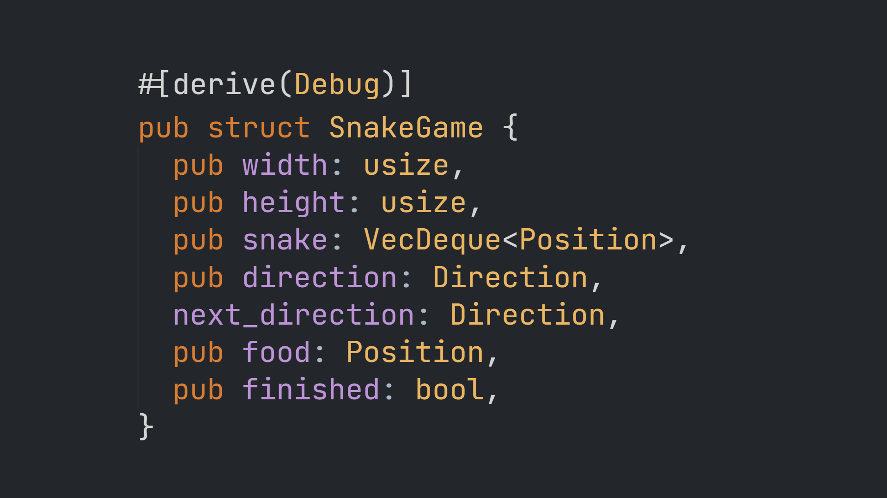

# 
# Simple_Snake_Game
A simple Snake game implemented in Rust and WebAssembly.

Here is the a reusable library that you can incorporate into your projects.
[Link](https://crates.io/crates/simple_snake_game)


<br/> 

## Building

Make sure you have [Rust](https://www.rust-lang.org) installed and
[wasm-pack](https://rustwasm.github.io/wasm-pack/). To build this project, run:

```
$ wasm-pack build --target web
```

To run this project, you need a static file server. You can install `serve` with
npm:

```
$ npm install serve -g
```

Now, start your static file server and open `index.html`:

```
$ serve
```
# snake_lib
Snake game reusable library that you can incorporate into your projects.
